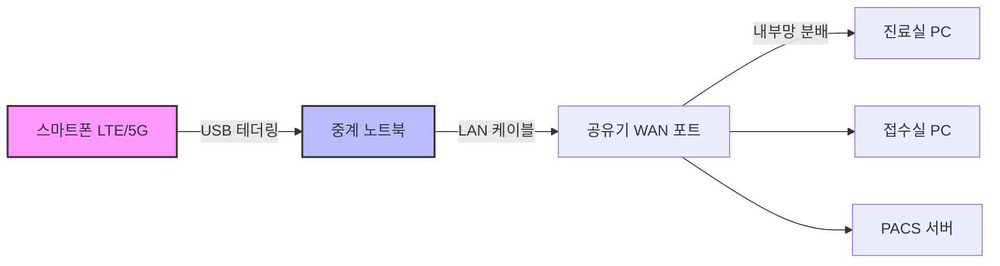

# 의원 네트워크 장애 비상 대응 가이드

## 들어가며

"원장님 인터넷이 안돼요" 하고 직원이 들어온다.

정확히 말하면 원내 EMR(차트) 프로그램은 켜지는데(요새 클라우드 차트 프로그램은 접속이 안 될수 있음) **수진자 자격 조회(공단 접속)**가 안 되고, 처방을 내려도 **DUR 점검(심평원 접속)**이 먹통인 상황이다. 환자는 와 있는데 접수가 안 되니 데스크는 난리가 난다.

물론 네이버, 구글도 안 들어가진다.

물론 이런 해결 방법은 구글에 검색해 보거나, Gemini나 ChatGPT에게 물어봐도 금방 찾을 수 있을지 모른다. 하지만 환자들이 웅성거리고 데스크 전화가 빗발치는, **그 1분 1초가 피 말리는 상황에서** 침착하게 검색하고 AI에게 프롬프트를 입력할 정신이 있을까?

겪어보니 알겠다. 그런 조마조마한 순간에는 모니터 옆에 붙여둔 투박한 출력물 한 장이 주는 안심감이 절대적이라는 것을. **이 가이드는 그런 아찔한 상황을 온몸으로 겪어본 내가, 혹시 모를 미래의 나를 위해 남기는 철저한 '생존 기록'이다.**

---

## 핵심 Action Plan

**휴대폰 테더링(데이터/테더링 용량 주의⚠️) + 윈도우 노트북으로 병원 전체 인터넷 살리기**



1. 스마트폰 핫스팟 켜고 노트북에 USB 연결
2. 노트북에서 인터넷 공유 설정 (ICS)
3. 노트북과 공유기 WAN 포트를 랜선으로 연결
4. 끝. 병원 전체 인터넷 복구

복잡한 명령어 없이, 노트북이 인터넷을 받아서 공유기에 뿌려주는 가장 안전한 방식이다.

---

## 방법 1: 스마트폰 + 노트북 중계 (권장)

> [!CAUTION]  
> **💰 실행 전 '요금제' 체크! 무제한의 함정**  
> 스마트폰 요금제가 '데이터 무제한'이라도, **테더링(핫스팟) 데이터는 월 10GB~50GB로 제한**된 경우가 대부분입니다.  
> * **위험:** 한도 초과 시 **속도가 400kbps로 떨어져(진료 불가능)** EMR이 멈추거나, **추가 요금**이 발생할 수 있습니다.  
> * **확인:** 통신사 고객센터 앱(T world 등)에서 **'테더링/공유 데이터 잔여량'**을 반드시 확인하세요.

### 준비물

미리 준비해두면 긴급 상황에서 당황하지 않는다. 평상시에 스마트폰과 노트북 연결을 해보고 준비 해놓기를 **적극 권장**한다.

| 항목 | 설명 |
| :--- | :--- |
| **테더링 스마트폰** | 🚨 **요금제 확인 필수!**<br>데이터 무제한이라도 **'테더링 한도'**는 별도인 경우가 많음. (초과 시 추가 과금 or 속도 저하) |
| **윈도우 노트북** | 유선 랜포트 필수 (없으면 USB-LAN 젠더) |
| 테더링 사전 셋업 | 아이폰은 iTunes 설치 필요 (드라이버 인식용), 안드로이드 스마트폰도 드라이버 설치 필요 할 수도 있음 |
| **케이블** | 충전 케이블 1개, 랜선 1개 |

### 1단계: 스마트폰 ↔ 노트북 연결

1. 노트북 WiFi 끄기
2. 스마트폰을 USB로 연결
3. 스마트폰에서 USB 테더링 켜기
   - **아이폰**: 설정 > 개인용 핫스팟 > 다른 사람의 연결 허용 ON
     - "이 컴퓨터를 신뢰하시겠습니까?" 팝업 → **[신뢰]** 선택
   - **안드로이드**: 설정 > 연결 > 모바일 핫스팟 및 테더링 > USB 테더링 ON
4. 노트북에서 인터넷 되는지 확인

### 2단계: 노트북 인터넷 공유 설정 (ICS)

1. `Win + R` → `ncpa.cpl` 입력 → 엔터
2. 스마트폰 연결된 어댑터 찾기
   - **아이폰**: Apple Mobile Device Ethernet
   - **안드로이드**: Samsung Mobile USB Remote NDIS... 또는 Remote NDIS...
3. 해당 어댑터 우클릭 → **속성**
4. **공유** 탭 클릭
5. ☑ "다른 네트워크 사용자가 이 컴퓨터의 인터넷 연결을 통해 연결하도록 허용" 체크
6. **홈 네트워킹 연결**: 이더넷(유선 랜카드) 선택
7. **확인** (IP가 192.168.137.1로 변경된다는 팝업 → **예**)

### 3단계: 노트북 ↔ 공유기 연결

- 노트북 랜포트 → **공유기 WAN 포트** 랜선 연결
- ⚠️ **LAN 포트가 아닌 WAN 포트에 연결해야 한다**

### 4단계: 공유기 설정

> [!WARNING]
> **중요: 공유기 설정 변경 전 필수**
> 반드시 현재 공유기의 WAN 설정(고정 IP 정보) 화면을 스마트폰으로 사진 찍어두세요!
> 
> 병원 인터넷(기업용 회선)은 대부분 고정 IP를 사용한다. 인터넷 복구 후 원상 복구할 때, 원래의 IP 주소/서브넷 마스크/게이트웨이/DNS를 기억 못 하면 인터넷 기사님 올 때까지 며칠간 인터넷을 못 쓸 수 있다.

1. 공유기 관리자 페이지 접속
2. **인터넷 설정** (WAN 설정) 메뉴
3. **연결 방식: 자동 IP (DHCP)** 로 변경
4. 저장 후 연결 상태 확인

### 트러블슈팅

| 문제 | 해결 |
|------|------|
| IP 충돌 | 내부망이 192.168.137.x 대역 사용 시 발생 (보통은 0.x나 1.x라 괜찮음) |
| 랜선 방향 | 반드시 WAN 포트에 연결 |
| 아이폰 신뢰 | "이 컴퓨터를 신뢰하시겠습니까?" 팝업에서 신뢰 필수 |
| 공유 설정 안 먹힘 | 체크 해제 → 재체크 또는 노트북 재부팅 |

---

## 🚨 스마트폰 인터넷 연결 직후 최우선 조치 사항

인터넷이 살아나면 **즉시** 아래 조치를 취해야 한다. 안 하면 데이터 폭탄 맞는다.

### 1. IPTV 및 게스트 네트워크 즉시 차단

> [!CAUTION]
> **가장 먼저 해야 할 일!**
> 
> 대기실 TV(IPTV)가 켜져 있으면 영상 스트리밍으로 데이터가 **분당 수백 MB씩** 증발한다. 환자/보호자용 게스트 와이파이도 마찬가지. 누군가 유튜브라도 틀면 끝이다.

**즉시 실행:**
- **IPTV**: 전원 OFF 또는 셋톱박스 랜선 뽑기
- **게스트 WiFi**: 공유기 설정에서 게스트 네트워크 비활성화, 또는 게스트(환자/보호자)용 공유기 전원 OFF
- **대기실 안내**: "네트워크 점검 중" 안내문 부착

### 2. 직원 스마트폰 와이파이 즉시 차단

> [!CAUTION]
> **"지금 즉시 휴대폰 와이파이 끄세요!"**
> 
> 병원 직원들의 스마트폰은 보통 병원 와이파이에 자동 연결되어 있다. 인터넷이 복구되는 순간, 직원들 폰 10여 대가 동시에 '오! 와이파이 터진다' 하고 백그라운드에서 앱 업데이트, 카톡 사진 백업, 인스타 동영상 로딩을 시작한다.
> 
> 직원 5명이 인스타만 잠깐 봐도 **1GB는 금방 사라진다.**

**인터넷 연결 전**, 전 직원에게 **'휴대폰 와이파이 끄기'**를 명령하세요.

### 3. 원내 모든 PC 윈도우 업데이트 일시 정지

> [!CAUTION]
> **왜 중요한가?**
> 
> 원내 PC들은 공유기를 통해 인터넷이 들어오므로 이 신호를 **일반 유선 인터넷(Ethernet)**으로 인식한다. 즉, **"아, 나는 빵빵한 유선 인터넷에 연결되었구나!"**라고 착각하고 윈도우 업데이트나 백신 업데이트를 강행할 수 있다.
> 
> 중계 노트북에 '데이터 통신 연결' 설정을 해도 **진료실 PC들은 이게 테더링인지 전혀 모른다.** 그래서 각 PC마다 수동으로 업데이트를 막아야 한다.

**각 PC에서 즉시 실행:**

```
설정 > 업데이트 및 보안 > Windows 업데이트 > 7일 동안 업데이트 일시 중지
```

### 4. PC 카카오톡 및 클라우드 동기화 종료

> [!CAUTION]
> **숨겨진 데이터 도둑들!**
> 
> PC용 카카오톡이 켜지면서 고화질 사진/동영상을 다운로드하거나, 바탕화면에 깔린 **OneDrive, Google Drive, Dropbox, iCloud**가 동기화를 시작하면 치명적이다.
> 
> 인터넷이 끊겼던 동안 쌓인 파일들을 한꺼번에 동기화하려고 덤벼든다.

**작업표시줄 시계 옆 아이콘(트레이)**을 확인해서 클라우드 프로그램을 **'일시 정지'** 또는 **'종료'** 하세요.

### 5. CCTV 녹화기(NVR/DVR) 확인

요즘 CCTV는 클라우드나 외부 접속을 위해 인터넷에 연결된 경우가 많다. 실시간 영상을 외부로 송출하거나 클라우드에 저장하는 방식이라면 막대한 데이터를 쓴다.

**CCTV 본체 랜선을 뽑거나 전원을 끄는 것이 안전하다.**

### 6. 원내 BGM 스트리밍 중지

대기실용으로 PC에서 멜론이나 유튜브 뮤직을 하루 종일 틀어놓는 병원이 많다. 음악 스트리밍도 하루 종일 틀면 데이터 소모가 꽤 크다.

**오늘 하루는 음악 없이 진료하거나, 저장된 MP3만 재생하세요.**

### 7. 중계 노트북 데이터 통신 연결 설정

노트북 자체의 업데이트도 막아야 한다.

1. `Win + I` → **네트워크 및 인터넷**
2. 스마트폰 연결된 어댑터 선택 → **속성**
3. **데이터 통신 연결(Metered connection)** → **켬**

### 8. 카드 단말기 승인 테스트

인터넷이 되면 보통 카드 단말기도 되지만, 일부 구형 단말기나 POS는 고정 IP를 요구하거나 특정 보안 포트를 사용한다.

> [!TIP]
> **확인 방법: 100원 결제 후 취소**
> 
> 안 되면 백업용 LTE 단말기(보통 카드사에서 제공)를 꺼내야 한다.

---

## 방법 2: 안드로이드 공유기 USB 직결

> [!WARNING]
> **사전 확인 필수**
> 이 방법은 공유기가 USB 테더링을 지원해야만 가능하다. 사용 중인 공유기 매뉴얼이나 설정 화면에서 "USB 모뎀" 또는 "USB 테더링" 지원 여부를 먼저 확인할 것.

노트북 없이 공유기에 바로 연결하는 방법이다. 단, 아이폰은 지원 안 됨.

### 공유기 직결 시도

1. 갤럭시 → 공유기 USB 포트 연결
2. 갤럭시: **설정 > 연결 > 모바일 핫스팟 및 테더링 > USB 테더링 ON**
3. 공유기에서 USB WAN 연결 확인

**실패 시**: 방법 1(노트북 중계)로 진행

### 안드로이드 USB 테더링 지원 공유기

| 공유기 | 지원 수준 |
|--------|----------|
| **ASUS** | 전 모델 공식 지원 (가장 추천) |
| ipTIME | 최신 일부 모델 지원 |
| TP-Link | USB 동글 위주, 스마트폰 테더링 비공식 |

---

## 데이터 사용량 관리

병원 전체가 휴대폰 데이터를 쓰게 되므로 관리가 중요하다.

### 노트북에서 사용량 확인

1. `Win + I` (설정)
2. **네트워크 및 인터넷 > 상태 > 데이터 사용량**
3. 스마트폰 연결된 어댑터 항목 확인
4. **사용량 통계 다시 설정**으로 0부터 측정 가능

### 데이터 사용량 참고

| 용도 | 사용량 | 비고 |
|------|--------|------|
| EMR 텍스트 | 하루 수십 MB | ✅ 걱정 없음 |
| 수진자 자격조회 / DUR | 미미함 | ✅ 텍스트 기반 |
| **로컬 PACS** (원내 서버) | **없음** | ✅ 내부망 통신이라 인터넷 데이터 안 씀 |
| 클라우드 PACS / 외부 판독 | ⚠️ 대량 | 🔴 주의 필요 |
| 윈도우 업데이트 | ⚠️ 1~2GB | 🔴 순식간에 소모 |
| PACS 클라우드 백업 | ⚠️ **치명적** | 🔴 데이터 순식간에 증발 |
| IPTV 스트리밍 | ⚠️ **치명적** | 🔴 분당 수백 MB 소모 |
| 클라우드 동기화 (OneDrive 등) | ⚠️ **치명적** | 🔴 밀린 파일 한꺼번에 동기화 |
| CCTV 클라우드 전송 | ⚠️ **치명적** | 🔴 실시간 영상 업로드 |
| 음악 스트리밍 (멜론 등) | 시간당 50~150MB | 🟡 하루 종일 틀면 누적됨 |

> [!TIP]
> 원내 서버에 PACS가 있는 경우, X-ray 촬영/조회는 내부망 통신이라 **인터넷 데이터를 쓰지 않는다.** 단, 클라우드 PACS나 외부 판독 서비스를 쓴다면 주의.

---

## 긴급 체크리스트

### 연결 단계
- [ ] 노트북 WiFi 끄기
- [ ] 스마트폰 USB 테더링 켜기
- [ ] ICS 공유 설정
- [ ] 🔴 **공유기 WAN 설정 사진 찍기** (복구용)
- [ ] WAN 포트 연결 (LAN 아님)
- [ ] 공유기 DHCP 설정

### 연결 직후 필수 조치 (데이터 누수 차단)
- [ ] 🔴 **IPTV 끄기 / 셋톱박스 랜선 뽑기**
- [ ] 🔴 **게스트 와이파이(환자/보호자용 와이파이) 비활성화**
- [ ] 🔴 **전 직원 스마트폰 와이파이 끄기**
- [ ] 🔴 **원내 모든 PC 윈도우 업데이트 일시 정지**
- [ ] 🔴 **PC 카카오톡 / 클라우드 동기화 종료**
- [ ] CCTV 녹화기 랜선 뽑기 (클라우드 연동 시)
- [ ] BGM 스트리밍 중지
- [ ] 중계 노트북 데이터 통신 연결 설정
- [ ] 🔴 **카드 단말기 승인 테스트 (100원 결제 후 취소)**
- [ ] 직원 공지: 유튜브/대용량 다운로드 금지

---

## ⚠️ 참고: route 명령어 방식 (비권장)

> [!CAUTION]
> **경고**: `route delete` 명령어 사용 시 네트워크가 완전히 꼬일 수 있다. 복구하려면 재부팅 필요. 되도록 위의 노트북 중계 방식 사용 권장.

테더링(외부망)과 원내망(내부망)을 동시에 사용해야 할 경우, route 명령어로 트래픽 경로를 수동 지정하는 방법이 있다.

**상세 설정 방법**: https://cofs.tistory.com/292

### 핵심 원리
- 일반 인터넷 → 테더링으로 연결 (METRIC 낮게)
- EMR/PACS 서버 → 원내망으로 연결 (특정 IP 지정)

### 주의사항
- `route delete 0.0.0.0` 실행 시 모든 네트워크 경로가 삭제됨
- 설정 실수 시 인터넷/내부망 모두 접속 불가
- **복구**: 재부팅하면 초기화됨 (`-p` 옵션 미사용 시)

**결론**: 긴급 상황에서는 route 설정보다 **휴대폰 + 노트북 중계 방식**이 훨씬 안전하고 빠르다.

---

## 마치며

이 글이 필요한 상황이 안 오는 게 가장 좋겠지만, 만약의 경우를 대비해 이 페이지를 **즐겨찾기** 해두거나 **PDF로 출력**해서 접수 데스크 서랍에 넣어두시길 권한다.

다음 [진료실 생존스킬 #2]에서 또 다른 진료실 생존 지침으로 찾아뵙겠다.
